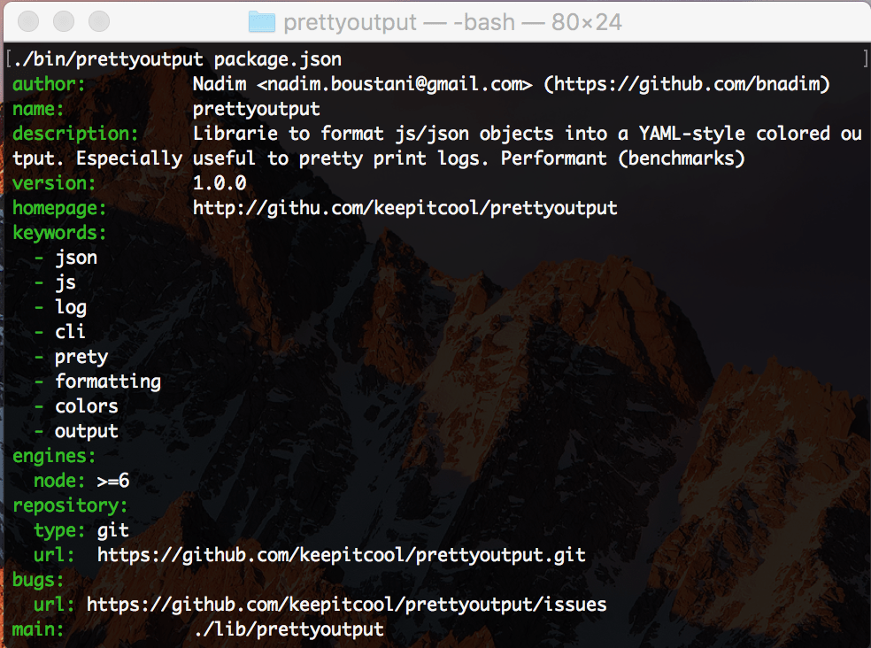
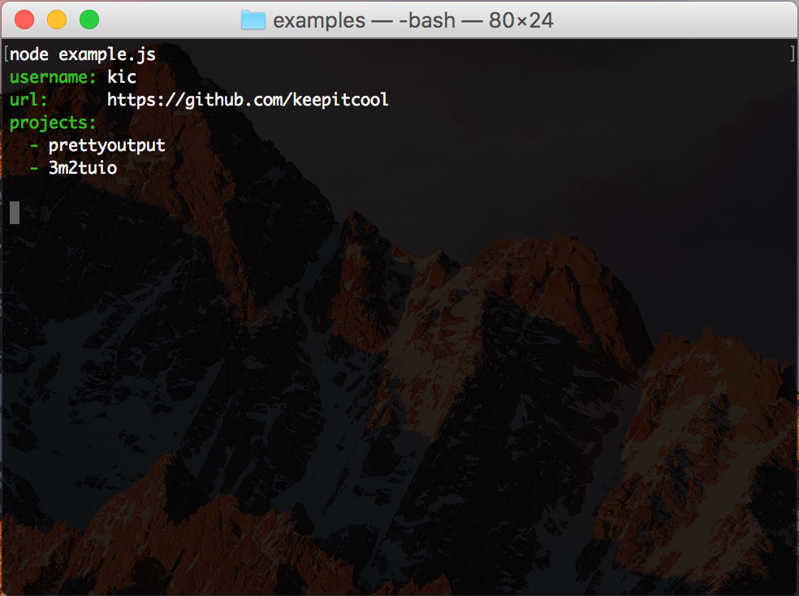

# prettyoutput [![NPM version][npm-image]][npm-url] [![build status][travis-image]][travis-url] [![Test coverage][coveralls-image]][coveralls-url]

Library to format js/json object into YAML style readable output.
It's performance centric to be used as a logger formatter.
It's currently 3 to 5 times quicker than util.inspect used by many loggers.
It's available as a NodeJS library or a cli too.

## Credits
This is based on the great work done on the project [prettyjson](https://github.com/rafeca/prettyjson)

## How to install

Via NPM:

```bash
$ npm install prettyoutput
```

## Using it

It's pretty easy to use. Just have include it in your script and call it:

```javascript
const prettyoutput = require('prettyoutput')

const data = {
  username: 'kic',
  url: 'https://github.com/keepitcool',
  projects: ['prettyoutput', '3m2tuio']
}

console.log(prettyoutput(data))
```

Output:



### API

```javascript
const prettyoutput = require('prettyoutput')
prettyoutput(data, options, indent)
```

Parameters are :
 * {*} data            : js or json object
 * {Object} [options]  : Optional. See options below
 * {number} [indent]   : Optional. Indent all output

Options are :
 * {number} [indentationLength]  : Length of indentation (in terms of space)
 * {number} [maxDepth]           : maximum sublevel of nested objects/arrays to output. Default: 3
 * {boolean} [noColor]           : disable colors. Default: false
 * {colors} [colors]             : Output colors. See below
 * {boolean} [alignKeyValues]    : Align key values. Default: true

Colors are :
 * {string} [keys]       : Objects keys color. Default: green
 * {string} [dash]       : Array prefixing dash ("- "). Default: green
 * {string} [number]     : Numbers color. Default: blue
 * {string} [string]     : Strings color. Default: no color
 * {string} [true]       : Boolean value 'true' color. Default: green
 * {string} [false]      : Boolean value 'false' color. Default: red
 * {string} [null]       : 'Null' color. Default: grey
 * {string} [undefined]  : 'Undefined' color. Default: grey

Example using options :
```javascript
const prettyoutput = require('prettyoutput')

const data = {
  username: 'kic',
  url: 'https://github.com/keepitcool',
  projects: ['prettyoutput', '3m2tuio']
}

const colors = {
  keys: 'blue',
  'null': 'red'
}

const options = {
  noColor: true,
  maxDepth: 5,
  colors: colors
};

console.log(prettyoutput(data, options, 2);
```

## Cli usage

Command line tool support file param or stdin.

Usage:
```bash
$ prettyoutput package.json
```

This should output :


### Command line options

It's possible to customize the output through some command line options:

```bash
# Indent 4, max depth 5, disable colors
$ prettyjson --indent=4 --depth=5 --noColor package.json
```

or

```bash
# Indent 4, max depth 5, disable colors
$ cat package.json | prettyjson --indent=4 --depth=5 --noColor
```

## Benchmark
Project target logging, so performance is an issue.
Currently, prettyoutput is 3 times quicker than util.inspect and 2.5 times quicker than prettyjson, the library it's inspired from.

To run benchmark, just run :
```bash
$ node benchmark/benchmark.js
```

Results :
```
LEVELS | KEYS | LOOPS | WEIGTHS
3      | 20   | 100   | serializable: 0.9    array: 0.3    object: 0.5    multilineString: 0.3    error: 0.2

NAME         | MIN                 | MAX                 | MEAN                | TOTAL
prettyoutput | 3 ms 133 µs 526 ns  | 42 ms 563 µs 146 ns | 4 ms 365 µs 617 ns  | 436 ms 561 µs 716 ns
prettyjson   | 9 ms 615 µs 703 ns  | 21 ms 441 µs 595 ns | 11 ms 447 µs 83 ns  | 1 s 144 ms 708 µs 348 ns
util.inspect | 10 ms 839 µs 974 ns | 24 ms 332 µs 545 ns | 12 ms 526 µs 168 ns | 1 s 252 ms 616 µs 884 ns


LEVELS | KEYS | LOOPS | WEIGTHS
4      | 20   | 100   | serializable: 0.9    array: 0.3    object: 0.5    multilineString: 0.3    error: 0.2

NAME         | MIN                 | MAX                  | MEAN                 | TOTAL
prettyoutput | 29 ms 966 µs 837 ns | 102 ms 170 µs 779 ns | 39 ms 502 µs 799 ns  | 3 s 950 ms 279 µs 972 ns
prettyjson   | 86 ms 731 µs 622 ns | 159 ms 166 µs 633 ns | 107 ms 813 µs 674 ns | 10 s 781 ms 367 µs 439 ns
util.inspect | 90 ms 942 µs 290 ns | 256 ms 995 µs 418 ns | 118 ms 794 µs 343 ns | 11 s 879 ms 434 µs 322 ns


LEVELS | KEYS | LOOPS | WEIGTHS
5      | 20   | 100   | serializable: 0.9    array: 0.3    object: 0.5    multilineString: 0.3    error: 0.2

NAME         | MIN                      | MAX                      | MEAN                     | TOTAL
prettyoutput | 616 ms 495 µs 243 ns     | 1 s 602 ms 965 µs 211 ns | 768 ms 761 µs 315 ns     | 76 s 876 ms 131 µs 544 ns
prettyjson   | 1 s 294 ms 734 µs 939 ns | 1 s 686 ms 600 µs 593 ns | 1 s 490 ms 394 µs 707 ns | 149 s 39 ms 470 µs 777 ns
util.inspect | 1 s 623 ms 160 µs 631 ns | 2 s 460 ms 983 µs 994 ns | 1 s 731 ms 699 µs 847 ns | 173 s 169 ms 984 µs 758 ns

```

## Running Tests

To run the test suite first invoke the following command within the repo,
installing the development dependencies:

```bash
$ npm install
```

then run the tests:

```bash
$ npm test
```

[npm-image]: https://img.shields.io/npm/v/prettyoutput.svg?style=flat-square
[npm-url]: https://www.npmjs.com/package/prettyoutput
[travis-image]: https://img.shields.io/travis/keepitcool/prettyoutput/master.svg?style=flat-square
[travis-url]: https://travis-ci.org/keepitcool/prettyoutput
[coveralls-image]: https://img.shields.io/codecov/c/github/keepitcool/prettyoutput.svg?style=flat-square
[coveralls-url]: https://codecov.io/github/keepitcool/prettyoutput?branch=master
